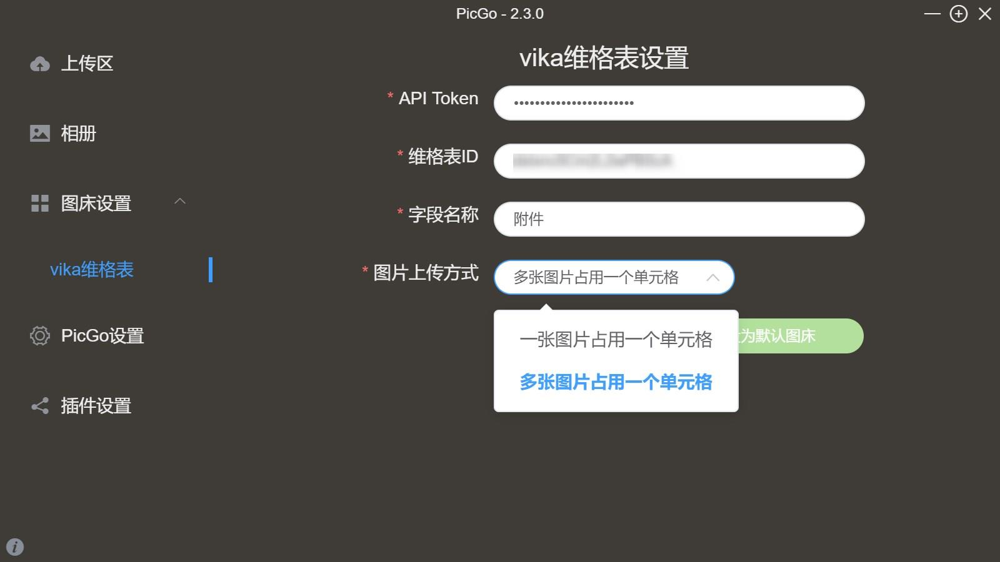

# picgo-plugin-vikadata

> An uploader for vikadata.

基于 Picgo 开发的一款上传插件，你可以方便地将本地文件（图片、文档、PDF等等各种格式的文件）上传至vika维格表。

 

## 🎨 如何安装

- 在线安装

打开 PicGo 详细窗口，选择插件设置，搜索 vikadata 安装，然后重启应用即可。

> 注意：你必须安装 Node.js 之后才能使用此方式安装 PicGo 的插件，因为 PicGo 是依赖 npm 来安装插件。

 

- 离线安装

除了在线安装，你还可以下载本项目的代码到本地，然后跟着官方的教程进行安装

👉 [如何离线安装](https://picgo.github.io/PicGo-Doc/zh/guide/config.html#%E7%A6%BB%E7%BA%BF%E5%AE%89%E8%A3%85)

 

## 🚀 如何使用

安装完毕后，需要进行简单的设置。
打开 Picgo 详细窗口 > 图床设置 > vika维格表。

跟随界面指引，填写设置参数：
- 你的维格表帐号下的API Token
- 图片需要上传到哪张表
- 指定附件字段用于存储图片
- 上传的方式。如果选择“一张图片占用一个单元格”，当批量上传图片的时候，插件会自动在维格表里新增行，一行的指定字段存储一张图片，然后循环上述动作；如果选择“多张图片占用一个单元格”，则插件本次操作总共只会创建一行，然后将所有上传的图片都存储到指定的附件字段中。

设置完毕后，即可使用PicGo的能力进行文件上传。
详细的使用说明，请看官方文档

👉 [PicGo 使用说明](https://molunerfinn.com/PicGo/)